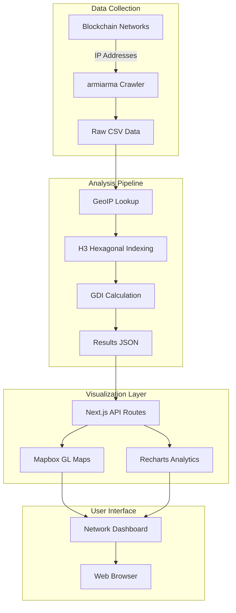
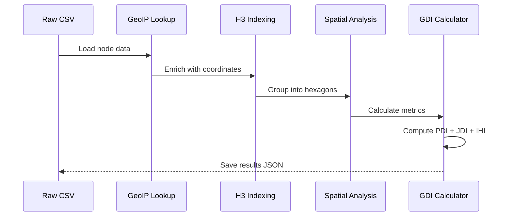
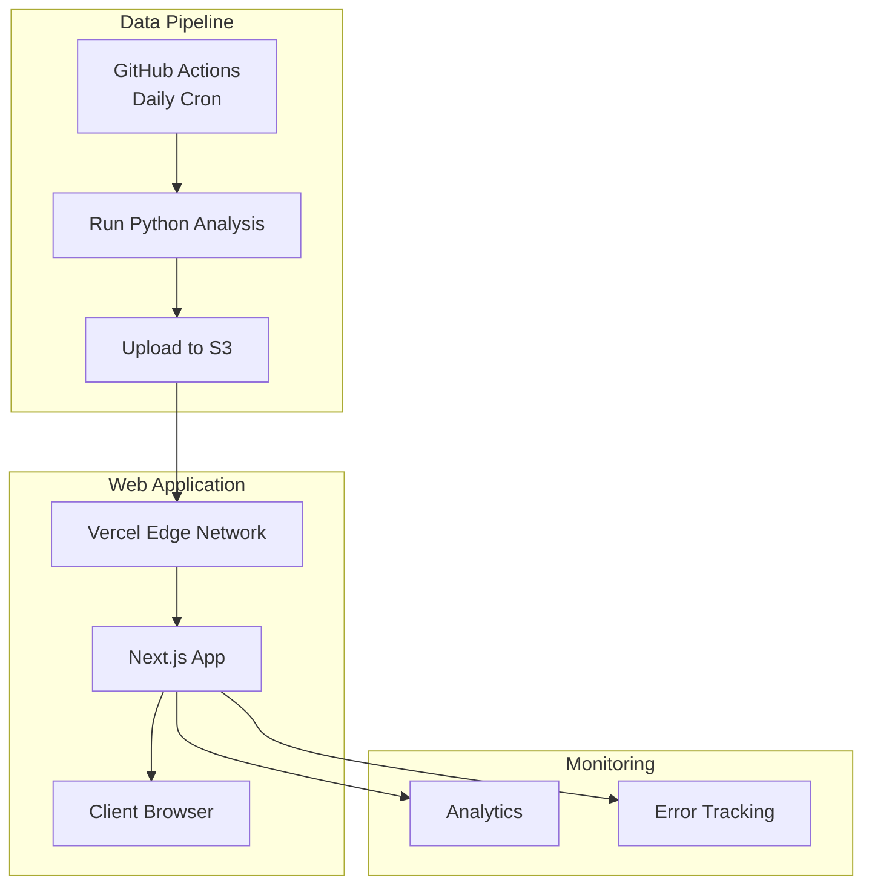

# GEOBEAT Architecture

## System Overview



## What is GEOBEAT?

GEOBEAT measures **geographic decentralization** of blockchain networks using spatial analysis techniques. It answers the question: *"How distributed are these supposedly decentralized networks?"*

### Geographic Decentralization Index (GDI)

**Formula:** `GDI = 0.4 × PDI + 0.35 × JDI + 0.25 × IHI`

- **PDI (Political Decentralization Index)** - Country-level distribution
  - Measures concentration across countries
  - Uses Moran's I spatial autocorrelation
  - Lower HHI = more distributed

- **JDI (Jurisdictional Decentralization Index)** - Regional spread
  - Analyzes spatial clustering patterns
  - Uses H3 hexagonal indexing (500km cells)
  - Identifies geographic hotspots

- **IHI (Infrastructure Heterogeneity Index)** - Provider diversity
  - Tracks cloud provider concentration
  - Measures hosting centralization risk
  - Amazon/Google/Microsoft dominance

## Component Architecture

### 1. Data Collection Layer

**Tools:** `armiarma` (git submodule in `/data-sources/tools/`)

**Purpose:** Crawl blockchain networks to discover node locations

**Process:**
1. Connect to network peer-to-peer protocol
2. Discover nodes via `getaddr` (Bitcoin) or ENR records (Ethereum)
3. Extract IP addresses
4. Save to CSV format

**Output:**
```csv
ip,port,country,city,latitude,longitude,asn,org
142.93.5.12,30303,US,New York,40.7128,-74.0060,14061,DigitalOcean
```

**Supported Networks:**
- Ethereum (execution + consensus layers)
- Filecoin
- Polygon
- Celo

### 2. Analysis Layer (Python)

**Location:** `/src/analysis/`

**Core Files:**
- `gdi.py` - Main GDI calculation entry point
- `gdi_standalone.py` - Self-contained implementation with embedded calculations
- `spatial_metrics.py` - Spatial analysis utilities (Moran's I, spatial HHI, ENL)
- `models.py` - Pydantic data models for validation
- `data_ingestion.py` - CSV loading and preprocessing

**Key Dependencies:**
- **GeoPandas** - Geographic data manipulation
- **PySAL** - Spatial analysis library (autocorrelation, weights)
- **H3-py** - Uber's hexagonal hierarchical indexing
- **Pydantic** - Data validation and type safety

**Algorithm Flow:**



**Example Calculation:**

```python
from spatial_metrics import SpatialAnalyzer
import geopandas as gpd

# Load node data
gdf = gpd.read_file("ethereum_nodes.geojson")

# Create analyzer
analyzer = SpatialAnalyzer(gdf)

# Calculate components
pdi = analyzer.calculate_pdi()  # Country distribution
jdi = analyzer.calculate_jdi()  # Spatial clustering
ihi = analyzer.calculate_ihi()  # Provider diversity

# Compute GDI
gdi = 0.4 * pdi + 0.35 * jdi + 0.25 * ihi
```

### 3. API Layer (Next.js)

**Location:** `/src/frontend/geobeat-ui/app/api/`

**Endpoints:**

```typescript
GET /api/networks/[id]/nodes
  ?format=geojson        // Returns GeoJSON for Mapbox
  ?format=points         // Returns point array
  ?resolution=4          // H3 resolution (0-15)
```

**Response Format:**

```json
{
  "type": "FeatureCollection",
  "features": [
    {
      "type": "Feature",
      "geometry": {
        "type": "Point",
        "coordinates": [-122.4194, 37.7749]
      },
      "properties": {
        "node_id": "ethereum-node-0001",
        "network": "ethereum",
        "city": "San Francisco",
        "country": "US",
        "cloud_provider": "AWS"
      }
    }
  ]
}
```

**Caching Strategy:** Currently in-memory (future: Redis)

### 4. Presentation Layer (React/Next.js)

**Location:** `/src/frontend/geobeat-ui/`

**Key Components:**

- **`components/network-map.tsx`** - Mapbox GL interactive map
  - Heatmap layer for density visualization
  - Hexbin overlay for H3 aggregation
  - Click handlers for node details

- **`components/triangle-chart.tsx`** - Ternary plot for GDI breakdown
  - Shows PDI, JDI, IHI contributions
  - Interactive tooltips

- **`components/network-grid.tsx`** - Network comparison cards
  - GDI scores for all networks
  - Trend indicators
  - Quick stats

**State Management:**
- React hooks (`useState`, `useEffect`)
- No external state library (keeping it simple)
- Server Components for data fetching

**Styling:**
- Tailwind CSS 4.1 with OKLCH color space
- Custom design tokens for GDI components
- Responsive layout (mobile-first)

## Data Flow

### End-to-End Example: Ethereum Analysis

```mermaid
flowchart LR
    A[Ethereum P2P Network] --> B[armiarma Crawler]
    B --> C[CSV: 10,000 IPs]
    C --> D[GeoIP: MaxMind]
    D --> E[GeoPandas DataFrame]
    E --> F[H3 Resolution 5<br/>500km hexagons]
    F --> G[Spatial Analysis:<br/>Moran's I, HHI, ENL]
    G --> H[GDI Score: 62.5]
    H --> I[gdi_results.json]
    I --> J[Next.js API]
    J --> K[Mapbox Visualization]
    K --> L[User Dashboard]
```



1. **Crawl** - armiarma discovers 10,000 Ethereum nodes
2. **Geolocate** - MaxMind GeoLite2 provides lat/lon
3. **Index** - H3 groups nodes into 500km hexagons
4. **Analyze** - Calculate Moran's I (spatial autocorrelation), HHI (concentration), ENL (diversity)
5. **Compute** - Weighted GDI score (0-100)
6. **Visualize** - Mapbox heatmap + hexbins + analytics
7. **Present** - Interactive dashboard with filters

## Technology Stack

| Layer | Technology | Version | Purpose |
|-------|-----------|---------|---------|
| **Analysis** | Python | 3.11+ | GDI calculation |
| Spatial | GeoPandas | 0.14+ | Geographic data manipulation |
| Spatial | PySAL | 24.1+ | Spatial statistics |
| Indexing | H3-py | 3.7+ | Hexagonal spatial indexing |
| Validation | Pydantic | 2.5+ | Data models |
| **Frontend** | Next.js | 16.0 | Web application framework |
| UI | React | 19.2 | Component library |
| Maps | Mapbox GL | 3.16 | Interactive maps |
| Charts | Recharts | 2.15 | Data visualization |
| Styling | Tailwind CSS | 4.1 | Utility-first CSS |
| Types | TypeScript | 5.x | Type safety |

## Deployment Architecture

### Current (Development)

```
Local Machine
├── Python analysis scripts (manual execution)
├── Next.js development server (npm run dev)
└── Static JSON files for data
```

### Production (Planned)



**Hosting:**
- **Frontend:** Vercel (Next.js native platform)
- **Data:** S3 or GitHub (static JSON)
- **Analysis:** GitHub Actions (scheduled runs)

**CDN:** Vercel Edge Network (global distribution)

## Key Design Decisions

### Why H3 Hexagonal Indexing?

**Chosen over traditional grids** because:
- ✅ Uniform cell area (lat/lon grids distort near poles)
- ✅ Hierarchical structure (zoom levels)
- ✅ Seven neighbors (easy distance calculations)
- ✅ Industry standard (Uber, Foursquare, DoorDash)

**Resolution 5 = ~252 km²** chosen for city-level granularity

### Why Next.js App Router?

**Chosen over Pages Router** because:
- ✅ Server Components reduce bundle size
- ✅ Streaming and Suspense support
- ✅ Built-in API routes
- ✅ Better TypeScript integration
- ✅ Future-proof (recommended by Next.js team)

### Why PySAL for Spatial Analysis?

**Chosen over custom implementations** because:
- ✅ Peer-reviewed algorithms
- ✅ Widely cited in academic research
- ✅ Handles edge cases (sparse data, boundaries)
- ✅ Active maintenance and community
- ✅ Integration with GeoPandas

### Why Mapbox GL over alternatives?

**Chosen over Google Maps, Leaflet** because:
- ✅ Vector tiles (smooth zooming)
- ✅ WebGL rendering (60fps)
- ✅ Custom styling with JSON
- ✅ Excellent GeoJSON support
- ✅ Free tier sufficient for demo

## Security Considerations

### Data Privacy

**What we collect:**
- ✅ Publicly available IP addresses from blockchain P2P networks
- ✅ GeoIP-derived locations (city-level accuracy)
- ✅ Cloud provider attribution from WHOIS

**What we DON'T collect:**
- ❌ User identity or wallet addresses
- ❌ Transaction data
- ❌ Personal information

### API Security

**Current:** No authentication (public dashboard)

**Future:** Rate limiting (100 req/min per IP)

## Performance Characteristics

### Analysis Pipeline

- **10,000 nodes:** ~30 seconds (including GeoIP lookup)
- **H3 indexing:** ~5 seconds
- **GDI calculation:** ~10 seconds
- **Bottleneck:** Spatial weights matrix construction

### Frontend

- **First Load:** ~2.5s (optimized bundles)
- **Map Interaction:** 60 FPS (WebGL)
- **Data Fetching:** <500ms (GeoJSON cached)
- **Bundle Size:** ~450 KB (gzipped)

## Future Enhancements

### Short-term (Q1 2025)
- [ ] Real-time data updates via WebSocket
- [ ] Historical trend analysis (timeseries)
- [ ] Comparative network view (side-by-side)
- [ ] Export functionality (PDF reports)

### Medium-term (Q2-Q3 2025)
- [ ] API with authentication
- [ ] Custom GDI weight configuration
- [ ] Multi-chain aggregated metrics
- [ ] Decentralization score alerts

### Long-term (Q4 2025+)
- [ ] Machine learning anomaly detection
- [ ] Predictive decentralization modeling
- [ ] Integration with on-chain data
- [ ] Community contributions dashboard

## Development Workflow

### Local Setup

```bash
# Clone with submodules
git clone --recurse-submodules https://github.com/DecentralizedGeo/geobeat.git
cd geobeat

# Python analysis
pip install -r requirements.txt
cd src/analysis
python gdi_standalone.py

# Frontend development
cd src/frontend/geobeat-ui
npm install
npm run dev  # http://localhost:3000
```

### Adding a New Network

1. **Data Collection:** Configure armiarma for new network
2. **Data Schema:** Add to `models.py` if custom fields needed
3. **Analysis:** Run `gdi_standalone.py` with new CSV
4. **Frontend:** Add network metadata to `network-data.ts`
5. **Visualization:** Logo and colors in public assets

## References

### Spatial Analysis
- [PySAL Documentation](https://pysal.org/)
- [H3 Hexagonal Indexing](https://h3geo.org/)
- [Moran's I Spatial Autocorrelation](https://en.wikipedia.org/wiki/Moran%27s_I)

### Decentralization Metrics
- [Nakamoto Coefficient](https://news.earn.com/quantifying-decentralization-e39db233c28e)
- [Balaji's Decentralization Guide](https://1729.com/decentralization)
- [Measuring Blockchain Decentralization](https://arxiv.org/abs/2101.10699)

### Frontend Technologies
- [Next.js Documentation](https://nextjs.org/docs)
- [Mapbox GL JS API](https://docs.mapbox.com/mapbox-gl-js/)
- [Tailwind CSS](https://tailwindcss.com/docs)

## Contact & Contributing

- **Repository:** [github.com/DecentralizedGeo/geobeat](https://github.com/DecentralizedGeo/geobeat)
- **Issues:** [GitHub Issues](https://github.com/DecentralizedGeo/geobeat/issues)
- **Contributing:** See [CONTRIBUTING.md](CONTRIBUTING.md)
- **License:** MIT (see [LICENSE](LICENSE))

---

Built with ❤️ for a more decentralized future.
